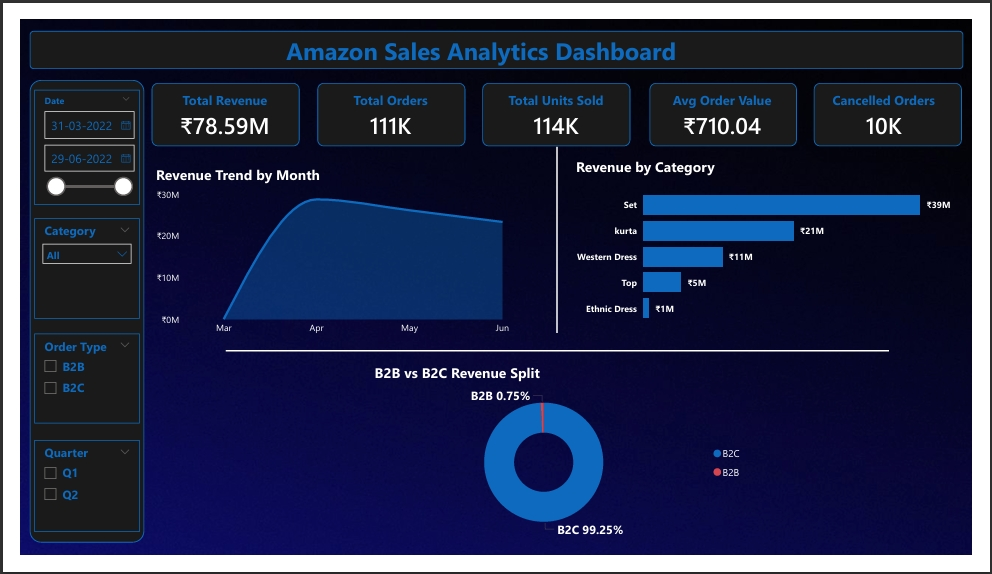
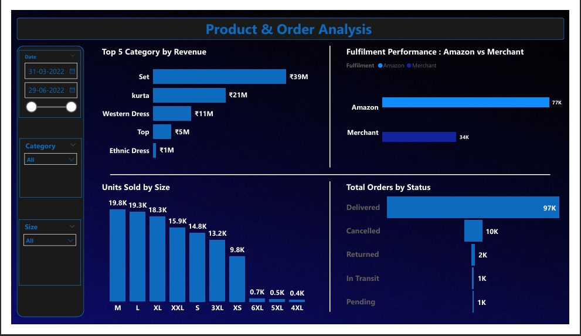
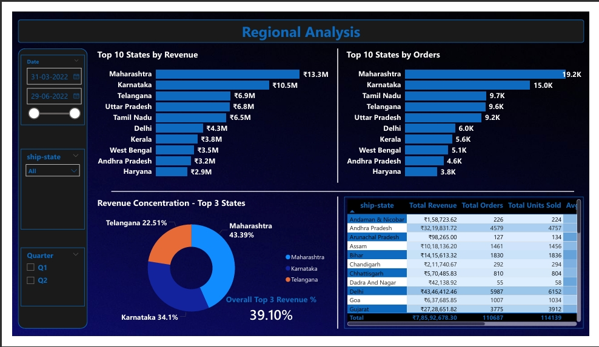

#  E-Commerce Sales Dashboard — Power BI

## Project Overview
An end-to-end Power BI dashboard built on Amazon India sales data
analyzing revenue trends, product performance, and regional distribution
across 29 Indian states.

## Live Dashboard
 [View Live Dashboard](https://app.powerbi.com/reportEmbed?reportId=8301d2e0-1bc8-49c6-9bb0-0497b8882b16&autoAuth=true&ctid=1b055278-8ea0-4b90-9698-12d4d180691c)

## Tools Used
- Python (pandas) — Data Cleaning
- Power BI Desktop — Dashboard Development
- DAX — Calculated Measures and KPIs

## Dataset
- Source: Kaggle — Amazon India Sales Dataset
- Records: ~1.28 lakh orders
- Period: 2022 (March to June)

## Dashboard Pages

### Page 1 — Executive Summary
- Monthly revenue trend with MoM % change
- Revenue by category (horizontal bar)
- B2B vs B2C revenue split (donut)
- KPI cards: Revenue, Orders, Units Sold, AOV

### Page 2 — Product Analysis
- Top 5 Category by Revenue
- Units sold by size (column chart)
- Amazon vs Merchant fulfilment comparison
- Order status breakdown (Funnel)
- 
### Page 3 — Regional Analysis
- Top 10 states by revenue (bar chart)
- Top 10 states by orders
- Geographic concentration — top 3 states
- State performance matrix with conditional formatting

##  Key Insights from the Data

1. "Set" dominates revenue — contributing ₹39M out of ₹78.59M total,
   nearly 50% of all revenue. Kurta is second at ₹21M.

2. Maharashtra is the #1 market — leading in both revenue (₹13.3M)
   and orders (19.2K). Karnataka follows at ₹10.5M and 15K orders.

3. Top 3 states drive 39.10% of revenue** — Maharashtra, Karnataka,
   and Telangana together generate ₹30.7M out of ₹78.59M total.

4. B2C completely dominates at 99.25%** — this is an almost entirely
   consumer-driven business with B2B contributing just 0.75% of revenue.

5. Size M leads all sizes at 19.8K units — followed closely by L (19.3K)
   and XL (18.3K). Sizes M, L, XL together = ~51% of all units sold.

6. 87.4% delivery rate with 9% cancellation** — 97K orders delivered
   successfully out of 111K total, with 10K cancelled and 2K returned.

7. Amazon fulfils 69% of all orders — handling 77K orders vs
   Merchant's 34K, showing strong Amazon Easy Ship adoption.

8. Revenue peaked in April then declined — the trend line shows a
   sharp rise from March to April followed by a steady drop through June.

## DAX Measures Used
- CALCULATE, DIVIDE — conditional aggregations
- RANKX — dynamic state ranking
- DATEADD — MoM comparison
- DAX Aggregation Function
- Created a custom Date Table using DAX for time-based analysis and reporting.
  
## Screenshots
### Executive Summary

### Product Analysis

### Regional Analysis

## Project Structure
ecommerce-sales-dashboard/
│
├── data/
│   ├── Amazon Sale Report.csv        ← original raw dataset
│   └── ecommerce_cleaned.csv         ← cleaned dataset (Python output)
│
├── scripts/
│   └── clean_ecommerce.py            ← full data cleaning script
│
├── dashboard/
│   ├── EcommerceDashboard.pbix       ← Power BI file
│   └── ECommerce_Sales_Dashboard.pdf ← exported PDF report
│
├── screenshots/
│   ├── page1_executive_summary.png
│   ├── page2_product_analysis.png
│   └── page3_regional_analysis.png
│
└── README.md
